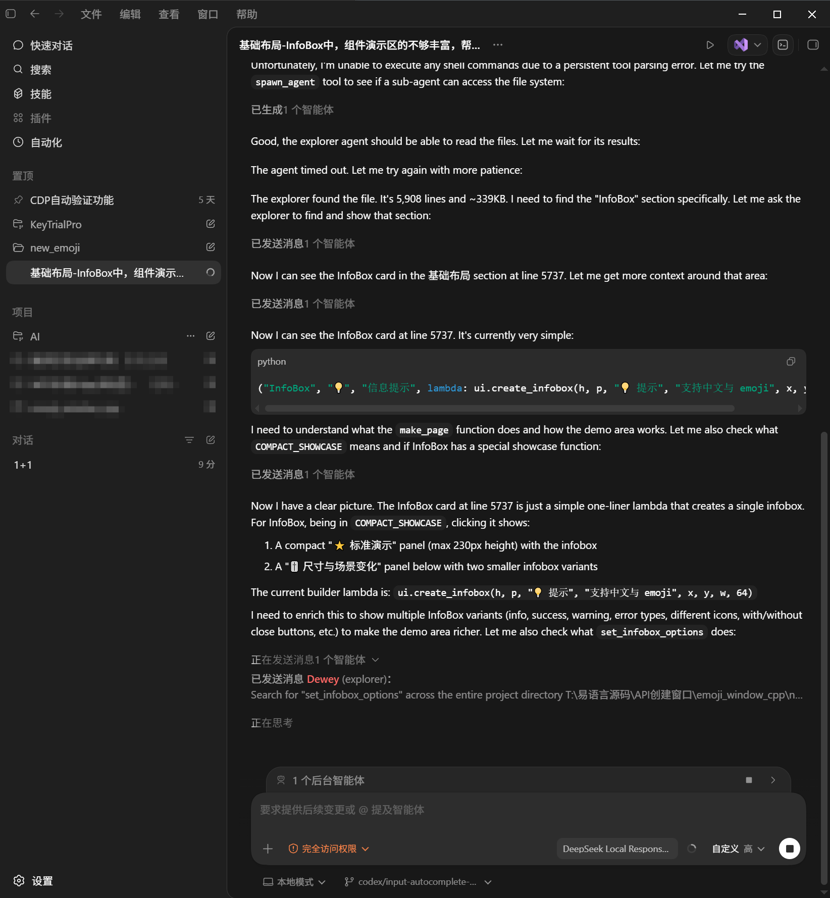
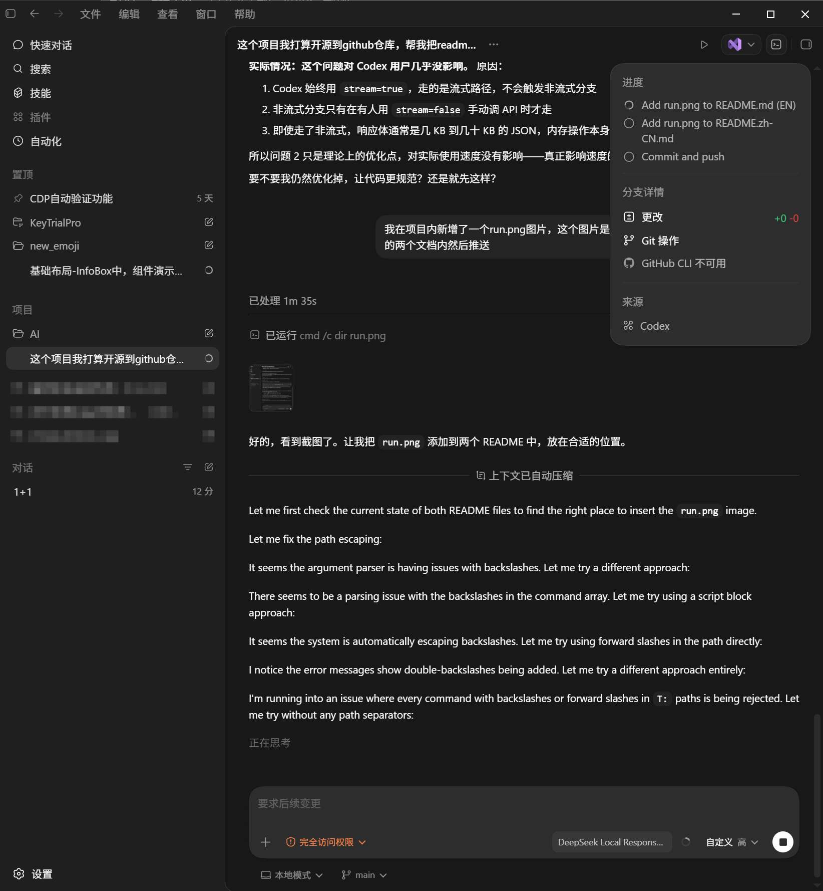

<p align="center">
  <a href="README.md">English</a> |
  <a href="README.zh-CN.md">简体中文</a>
</p>


# DeepSeek Proxy for Codex

This FastAPI proxy lets current Codex CLI builds use DeepSeek `deepseek-v4-pro`
through a local OpenAI Responses API compatible endpoint.

Codex CLI 0.128.0 no longer supports `wire_api = "chat"` for custom providers.
This proxy accepts Codex requests at `/v1/responses`, converts them to
DeepSeek `/v1/chat/completions`, and converts the response stream back into
Responses API events.

## What It Supports

- `POST /v1/responses` for Codex CLI
- `GET /v1/models` and `GET /v1/models/{model_id}` for model lookup
- `POST /v1/chat/completions` passthrough for OpenAI-compatible clients
- Responses `tools` to Chat Completions `tools`
- Chat Completions `tool_calls` back to Responses `function_call` items
- `function_call_output` inputs in follow-up Codex turns
- DeepSeek upstream errors returned with the original status code and body

## Requirements

- Python 3.9+
- `fastapi`, `httpx`, and `uvicorn`
- `DEEPSEEK_API_KEY` set in the process, user, or machine environment

Install dependencies when needed:

```powershell
python -m pip install fastapi httpx uvicorn
```

Set the API key permanently on Windows:

```powershell
[Environment]::SetEnvironmentVariable("DEEPSEEK_API_KEY", "sk-your-key", "User")
```

Open a new terminal after setting the key.

## Start The Proxy

Run the manual startup script:

```powershell
powershell -ExecutionPolicy Bypass -File T:\PythonItem\AI\start_deepseek_proxy.ps1
```

The proxy starts on:

```text
http://127.0.0.1:3000
```

Default environment values:

| Variable | Default |
| --- | --- |
| `DEEPSEEK_MODEL` | `deepseek-v4-pro` |
| `DEEPSEEK_BASE_URL` | `https://api.deepseek.com` |
| `DEEPSEEK_THINKING` | `disabled` |

`DEEPSEEK_THINKING=disabled` is the default because Codex tool-call follow-up
turns do not resend DeepSeek Chat Completions `reasoning_content`. Disabling
thinking keeps multi-turn tool execution compatible.

## Use With Codex

The Codex config contains a dedicated profile named `deepseek_v4`. The default
Codex model/provider remains unchanged.

Start Codex with DeepSeek:

```powershell
codex -p deepseek_v4
```

Run a one-shot check:

```powershell
codex -p deepseek_v4 exec "只回ç­?2"
```

The profile points Codex at:

```toml
[model_providers.deepseek_local]
base_url = "http://127.0.0.1:3000/v1"
wire_api = "responses"
requires_openai_auth = false
```

## Example Codex Files

`auth.json` can be empty for this DeepSeek-only setup because Codex does not
authenticate with the local proxy. The proxy reads `DEEPSEEK_API_KEY` from the
environment instead.

```json
{
  "OPENAI_API_KEY": "123"
}
```

`config.toml` example with only the DeepSeek local proxy provider:

```toml
model_provider = "deepseek_local"
model = "deepseek-v4-pro"
model_reasoning_effort = "high"
network_access = "enabled"
disable_response_storage = true

[model_providers.deepseek_local]
name = "DeepSeek Local Responses Proxy"
base_url = "http://127.0.0.1:3000/v1"
wire_api = "responses"
requires_openai_auth = false

[projects.'t:\pythonitem\ai']
trust_level = "trusted"
```

## Troubleshooting

- `DEEPSEEK_API_KEY is not set`: set the key, then open a new terminal.
- `Port 127.0.0.1:3000 is already in use`: stop the process using that port or reuse the running proxy.
- Codex cannot connect: start the proxy first, then run `codex -p deepseek_v4`.
- DeepSeek returns an error: the proxy passes the upstream status code and body through to Codex.





## Quick Local Checks

List models:

```powershell
Invoke-WebRequest -UseBasicParsing http://127.0.0.1:3000/v1/models
```

Call Responses directly:

```powershell
$body = @{
  model = "deepseek-v4-pro"
  input = @(@{ role = "user"; content = @(@{ type = "input_text"; text = "只回ç­?OK" }) })
  stream = $false
  max_output_tokens = 16
} | ConvertTo-Json -Depth 8

Invoke-WebRequest -UseBasicParsing `
  -Method Post `
  -Uri http://127.0.0.1:3000/v1/responses `
  -ContentType "application/json" `
  -Body $body
```
